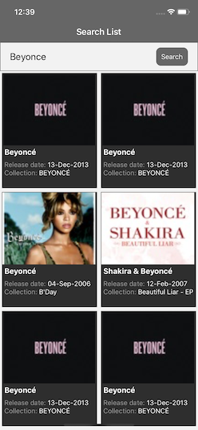

# ItuneAssignment

    

**Features:**

1. Application has been developed in React Native version 0.63.2.
2. Supports both iOS and Android devices.

**Requirements:**

- React Native CLI 
- Node setup
- Mac or Windowns OS
- Xcode 11 and Android studio setup
- Any editor to write React Native Code (VS Code)

**How to run:**

1. Clone the project from the https://github.com/Himanshu8910/ItuneSearchAssignment.git. 
2. Next to install the npm libraries, go to the project root directory and run 'npm install'
3. Go to the ios root folder and run 'pod install' to link the libraries.
4. Now go to project root forder and run 'react-native run-ios' to run the application.
5. By default the react native app runs on port 8081, but in some cases the 8081 port is reserved by some other application, if you face the same issue kindly follow  https://reactnative.dev/docs/troubleshooting#content .
5. To run the test cases, run 'npm test'

**Functionality:**

1. On launch of the application, it shows an empty screen with a search bar at the top. 
2. Type in the search bar to search for content within the iTune Store, App Store, iBooks, music and videos and hit search button.
3. The list of result will be displayed below the search bar.  
4. Tap on the item to see more details.
